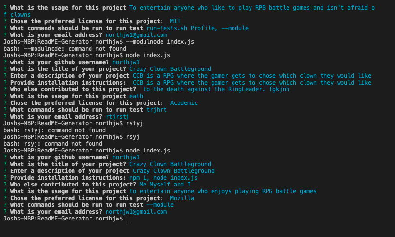

<h1>Read Me Generator </h1>

   ## Project Name ##
   Crazy Clown Battleground
    

##  Description  ##
Crazy Clown Battleground is an RPG where users get to battle it out as crazy clowns with a circus backdrop. Ending in a final fight to win control of the circus by killing the ring leader.
 

##  Table of Contents  ##

- [Description](#description) 
- [Installation](#installation) 
- [Usage](#usage) 
- [License](#license) 
- [Contributing](#contributing) 
- [Tests](#tests) 
- [Questions](#questions) 

## Description ##
    Crazy Clown Battleground is an RPG where users get to battle it out as crazy clowns with a circus backdrop. Ending in a final fight to win control of the circus by killing the ring leader.
## Installation ##
    npm i, node index.js
 ##  Usage ##
    to entertain anyone who enjoys playing RPG battle games
  ##  License ##
  This application is covered by the Mozilla license;
  
  
  ##  Contributors ##
  Me Myself and I
 
## Tests  ##
--module 
   

  

 ##  Questions  ## 
 GitHub: [northjw1](https://github.com/northjw1)  
 
 For any questions about this project please contact: northjw1@gmail.com   

